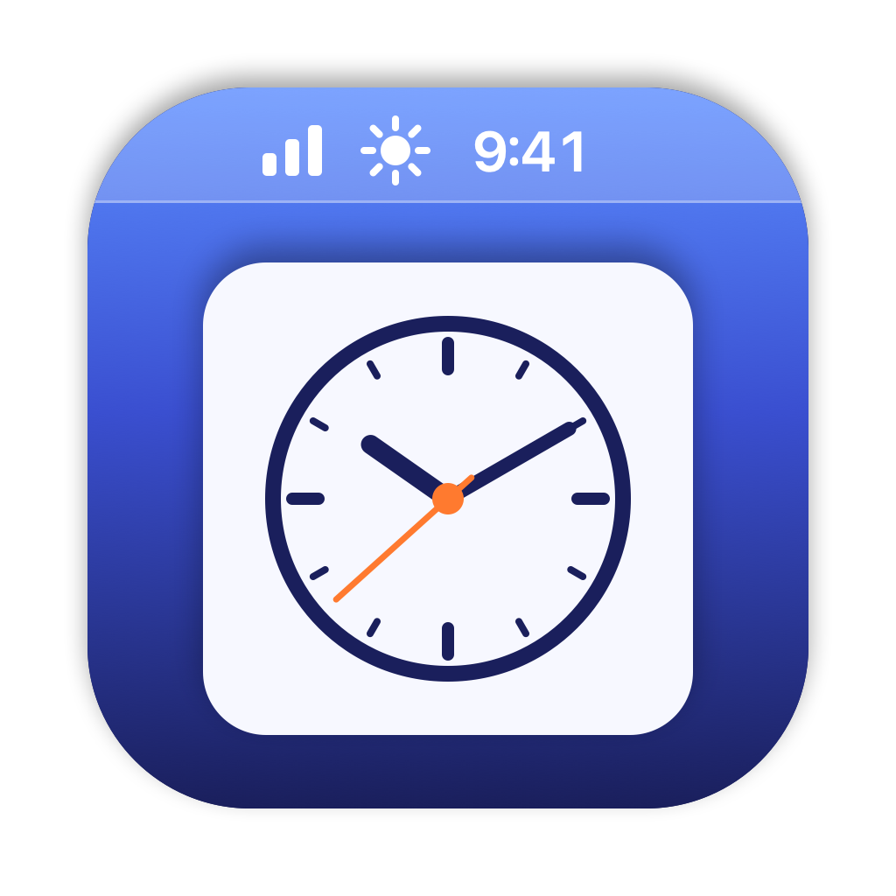

<p align="center">
  
</p>

<h1 align="center">MenuWidgets</h1>

<p align="center">A world clock, a weather forecast, your reminders and Claude usage meters in the macOS menu bar.</p>

MenuWidgets is a small native Swift app that adds four items to the menu bar.
Click one to open its panel; hover a row (or use ↑/↓) for a detail pane beside it.

- **Time** shows the date and time (`Thu Oct 8  7:49 AM`). Its panel lists your
  world clocks with offsets, sunrise and sunset, and the moon phase, with a map
  and twilight times for each zone.
- **Weather** shows the current temperature. Its panel has a multi-day
  forecast with the chance of rain per day and hourly rain bars. US locations
  use the National Weather Service forecast (what weather.gov shows); elsewhere,
  and as a fallback, it uses [Open-Meteo](https://open-meteo.com).
- **Reminders** shows a bell with how many Apple Reminders are left today
  (red, counting only those, while any are past due). Its panel lists
  overdue, today and tomorrow. Add one with a title and a "when" (`5pm`, `55m`,
  `sep 23 @ 3pm`, `tomorrow`), check one off (click again to undo), or click a
  row to edit its title, due time, repeat, URL and notes. Keys: ↑/↓, space,
  `a` add, `e` edit, `o` open link, `r` refresh, Esc. Alerts are left to
  Reminders' own notifications.
- **Claude** shows your Claude subscription usage: the current limit meters
  with reset countdowns, plus tokens by day and by model from your local Claude
  Code transcripts.

## Requirements

- macOS 15 or later
- Swift 6 (the Xcode Command Line Tools are enough: `xcode-select --install`)
- For the Claude widget: [Claude Code](https://claude.com/claude-code), signed in
  with a Claude subscription. MenuWidgets reads Claude Code's saved sign-in from
  the Keychain item `Claude Code-credentials`. It never refreshes or changes it.

## Install

```sh
git clone https://github.com/ianneub/mac-menu-widgets.git
cd mac-menu-widgets
scripts/install.sh
```

This builds the app, copies it to `~/Applications/MenuWidgets.app` and starts
it with a LaunchAgent (`com.ianneub.menu-widgets`), so it comes back at login.
The log is at `~/Library/Logs/MenuWidgets.log`.

The app is ad-hoc signed. If macOS asks, allow it to access your reminders
(for the Reminders widget) and the Keychain item (for the Claude widget).
macOS ties the Reminders permission to the app's signature, so an ad-hoc build
asks again after each rebuild. To keep it, sign with a stable identity (a
self-signed code-signing certificate from Keychain Access works): put its name
in `~/.config/menu-widgets/sign-identity` or `MENU_WIDGETS_SIGN_IDENTITY`.

The Reminders widget reads the URL field through ReminderKit, the private
framework under EventKit, since EventKit doesn't expose it. If a macOS update
changes that, only the URL field stops working.

To hide the system clock's time now that the Time widget shows it, set
**System Settings → Control Center → Clock Options → Style** to **Analog**.

### Uninstall

```sh
launchctl bootout "gui/$(id -u)/com.ianneub.menu-widgets"
rm -rf ~/Applications/MenuWidgets.app ~/Library/LaunchAgents/com.ianneub.menu-widgets.plist
```

## Configuration

Settings live in `~/.config/menu-widgets/config.json` and are reloaded when the
file changes. Every key is optional; anything missing uses the default. The
defaults are:

```json
{
  "time": {
    "timeFormat": "12h",
    "showDate": true,
    "zones": [
      { "name": "London", "tz": "Europe/London" },
      { "name": "UTC", "tz": "UTC" },
      { "name": "Denver", "tz": "America/Denver" },
      { "name": "Phoenix", "tz": "America/Phoenix" },
      { "name": "Los Angeles", "tz": "America/Los_Angeles" },
      { "name": "Anchorage", "tz": "America/Anchorage" }
    ]
  },
  "weather": {
    "name": "Atlanta GA",
    "latitude": 33.749,
    "longitude": -84.388,
    "forecastDays": 10,
    "showTodayRange": true,
    "unit": "F"
  },
  "agents": { "refreshIntervalSec": 900 }
}
```

- `timeFormat`: `"12h"` or `"24h"`.
- `zones`: an IANA time zone string (`"Asia/Tokyo"`) or an object with a
  `name`, `tz` and optional `lat`/`lon` for the map and sun times.
- `unit`: `"F"` or `"C"`.

## Development

```sh
scripts/test.sh                              # run the unit tests
scripts/build-app.sh                         # build build/MenuWidgets.app
swift scripts/make-icon.swift Assets/AppIcon.png   # redraw the app icon
```

`WidgetsCore` holds the pure logic (time zones, astronomy, weather and usage
parsing, the reminders agenda, repeat rules and "when" parsing) and its tests; `MenuWidgets` is the AppKit/SwiftUI app.

## License

[MIT](LICENSE)
